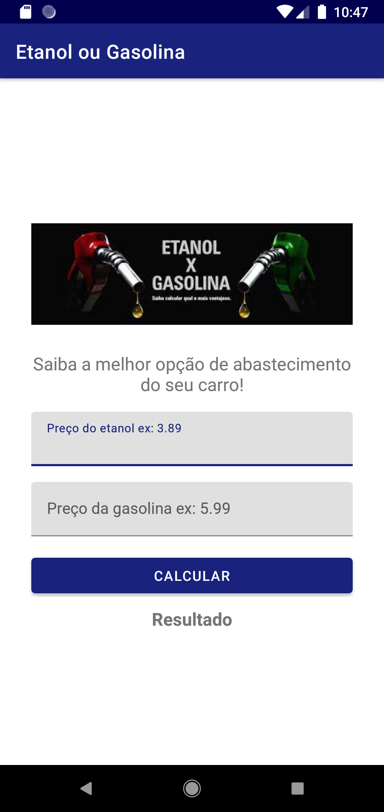
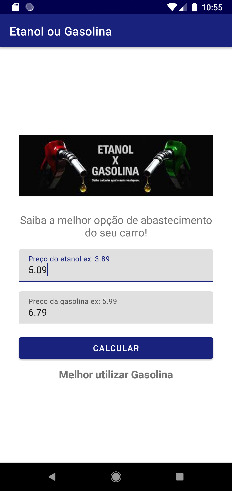

# Calculadora de Abastecimento (Aplicativo Android)

Este é um aplicativo Android simples que calcula a relação entre o preço do álcool e da gasolina para ajudar os usuários a decidirem qual combustível é mais vantajoso para abastecer seus veículos.

## Funcionalidades

- Insira o preço do álcool e da gasolina.
- O aplicativo calculará a relação entre os preços e indicará qual combustível é mais econômico.
- Interface intuitiva e fácil de usar.

## Capturas de Tela

|  |  |
| --------------------------------------------------------------------------------------------------- | ----------------------------------------------------------------------------------------- |

## Tecnologias Utilizadas

    

Este projeto foi desenvolvido utilizando as seguintes tecnologias:

- **Android Studio**: A IDE oficial para desenvolvimento de aplicativos Android.
- **Java**: A linguagem de programação utilizada para escrever a lógica do aplicativo.
- **XML**: Utilizado para criar a interface do usuário (UI) do aplicativo.
- **Git**: Sistema de controle de versão para gerenciar o código-fonte.

## Como Executar esse Projeto

1. Clone este repositório: `git clone https://github.com/paulorabelo/alcohol-gasoline.git`
2. Abra o projeto no Android Studio.
3. Execute o aplicativo em um emulador ou dispositivo Android.

## Download do  APK

1. Clique [aqui](https://drive.google.com/file/d/1HeLf263V-nYkNIgAIzVW_IE0hjSIV1U0/view?usp=drive_link) usando seu dispositivo Android.
2. Seu dispositivo irá solicitar a instalação do pacote pelo instalador do aparelho.
3. Dê permissão para instalar apps de fontes desconhecidas.

## Contribuição

Contribuições são bem-vindas! Se você encontrar algum problema ou tiver sugestões de melhorias, abra um **issue** ou envie um **pull request**.

## Licença

Este projeto está sob a licença MIT.